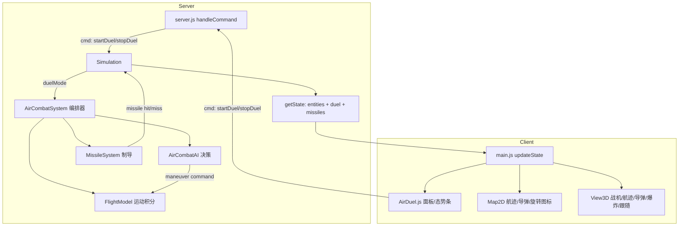

## 产品概述
在 SimCombat Pro 中新增「空战对决」功能：用户可在地图上自主布置红、蓝两架战机作为出场位置，系统以专门的双机格斗算法驱动整个作战过程——一架持续咬尾追击、抢占射击位，另一架在被咬尾时做规避机动（急转、桶滚、垂直机动、释放红外干扰弹）摆脱，双方以机炮与空空导弹互相攻击，率先击落对方者获胜。

## 核心功能
- **双机布置**：左侧新增「空战对决」面板，可分别选择红方/蓝方战机型号（隐身战机、重型战机、轻型战机），在地图上点选两架战机的出生点与初始航向，也提供「对称自动布置」一键生成相向而飞态势。
- **格斗算法**：驾驶层面的追击（纯追/前置拦射/高悠悠防冲过头）、防御（破S、桶滚、能量机动）、中距导弹对射与锁定/ECM干扰、近距航炮进入炮击锥判定。
- **武器系统**：近距航炮（须进入射界锥才可命中）、中距红外/雷达制导空空导弹（可被热焰弹与高过载规避摆脱），双方各有弹药与干扰弹余量。
- **过程可视化**：2D 地图显示航迹尾迹、导弹飞行轨迹、命中爆炸、雷达/锁定连线；3D 视图按真实高度与俯仰滚转渲染战机，支持双机跟随视角与低压 Sys tem 态势条。
- **胜负判定**：面板实时显示双方血量、速度、高度、距离、锁定/被锁告警与当前机动名称；一方被击落即判另一方获胜并弹出结算弹窗，整个过程可保存为回放。


## 技术栈选型
- **服务端**：沿用现有 Node.js + Express + `ws`（`pro/server`，端口 3002），CommonJS 模块、四空格缩进、中文注释。
- **前端**：沿用现有原生 HTML + Leaflet 1.9（2D）+ Three.js r128（3D）双视图，浏览器全局 class，无构建步骤。
- **传输**：沿用 WebSocket `cmd` 命令 + `broadcastState()` 单状态包广播模式，不引入新协议与新依赖。

## 实现方案

### 总体策略
在服务端新增一套**独立于地面 AI 的空战子系统**（飞行运动学 + 空战 AI + 导弹系统 + 编排器），由 `Simulation` 在 `duelMode` 下接管所有 `type === 'air'` 实体的更新；地面单位逻辑完全不变。客户端新增「空战对决」面板与可视化扩展（航迹、导弹、跟随视角、态势条），所有新逻辑通过 `state.duel` / `state.missiles` 增量字段驱动。

### 关键技术决策与权衡
1. **为什么不扩展 `SmartTacticalAI`**：其 `executeApproach` 是"走到目标点"的地面机动模型（`moveToPosition`），没有转向率、方位角、能量等空战概念；在其内部打补丁会污染地面单位决策。改为新增 `AirCombatAI`，由 `Simulation` 按 `duelMode` 分流，隔离风险。
2. **子步积分**：`server.js` 中 `dt = 1s`、`tickRate = 500ms`，战机 2200km/h ≈ 611m/s，单步位移过大导致轨迹呈折线。编排器内部按 **0.1s 子步迭代 10 次**（AI 决策 + 运动积分 + 导弹推进），保持对外 `Simulation.step()` 语义不变，缠斗轨迹平滑。复杂度 O(子步 × 实体数)，实体仅 2 架，开销可忽略。
3. **导弹作为独立轻量数组而非实体**：不进 `sim.entities`，避免污染 `updateStats/checkEndConditions/recordFrame/地面AI`；单独维护 `this.missiles`，上限 32 枚，过期或命中即回收。
4. **必要性修正（不改会直接跑不起来）**：
   - `Simulation.checkEndConditions()` 现用 `type !== 'air'` 过滤，纯空战场景双方都为 0，第一步就判平局并 `stop()` → 改为按"阵营存活实体数"判定，duel 分支优先。
   - `TerrainManager.getMovementSpeedModifier()` 对 `flight` 走 `?? params.speedMod` 再乘 `pass`，水域/山地 `pass=0` 会让战机速度为 0 → flight 直接返回 1。
   - `MovementSystem.moveEntity()` 的地形 `pass` 阻挡同理需对 air 跳过；`avoidCollisions` 的 30m 水平排斥不能作用于空中单位。
   - `Database.fighter.range = 15000` 对航炮过大 → 拆分为 `cannon.range ≈ 1500m` 与 `missile.range ≈ 6000~8000m`，保留 `range` 字段兼容旧代码。
5. **不放大既有负担**：`getState()` 每包已携带 40000 长度 `terrainType` 数组，新字段必须轻量（`missiles` 精简字段、截断 32 条），不做历史序列下发。

## 执行要点（防回归）
- `MovementSystem` 增加开关式跳过：`if (entity.type === 'air' && this.airDrivenExternally) continue;`，仅在 duel 模式下置真，地面行为零改动。
- 空战产生的事件沿用现有 `blackboard.combatEvents` 结构（`attacker/attackerName/attackerSide/target/targetName/damage/hit/distance`、击杀 `{type:'kill', killer, victim, ...}`），保证 `StatsPanel`、`addCombatLog`、`AttackAnimations` 无缝复用。
- 机型新增 `fighter_heavy`、`fighter_light`，原 `fighter`（歼-20）保持不变，避免破坏已保存回放与预设想定。
- 顺手修复 `main.js:310` 调用 `view3d.clearEffects()` 但 `View3D` 未定义的 TypeError。
- 所有新 how interv ention 仅作用于 duy 或有 air 实体的场景：`stopDuel/reset/clearAllEntities` 时清空 `missiles`、`duelMode = false`、`this.movement.airDrivenExternally = false`。
- 日志仅在状态迁移（锁定、发射、被锁告警、规避、击落）时输出，避免每子步刷屏。

## 架构设计



- **AirCombatAI**：按子步输出机动指令 `{desiredHeading, desiredAltitude, throttle, brake, fireCannon, launchMissile, flare, maneuverName}`；态势量含距离、接近率、相对方位 bearing、目标进入角 AA、机炮轴线偏角 ATA、高度差。
- **策略**：`OFFENSIVE`（前置拦射 + 高悠悠防冲过头）／`NEUTRAL`（占位、切半径）／`DEFENSIVE`（被尾追且在其武器包线内 → 破S/桶滚 + 干扰弹）／`MISSILE_LOCK`（中距占位锁定）。
- **FlightModel**：转向按 `turnRateDegPerSec` 限速（与速度/过载相关），速度在 `[minSpeed, maxSpeed]` 内受油门/阻力影响，垂直方向按 `climbRate` 逼近 `desiredAltitude`；边界提前回转而非硬夹取。
- **MissileSystem**：比例导引追击，到达即燃尽/超时自毁，近炸引信判定；目标机动过载与干扰弹按概率使其脱锁。

## 目录结构

```
pro/
├── server/
│   ├── server.js                                  [MODIFY] 新增 startDuel / stopDuel / setDuelStyle 三个 WebSocket 命令，复用既有 handleCommand 分支风格与 broadcastState()
│   └── src/
│       ├── engine/
│       │   ├── Simulation.js                      [MODIFY] 构造注入空战子系统；新增 duelMode/duelConfig/startDuel()/endDuel()；step() 在 duelMode 调用 AirCombatSystem.update() 并合并 combatEvents；checkEndConditions() 改为按阵营存活实体判定（duel 分支）；getState() 附加 duel 与 missiles；recordFrame() 附带导弹快照
│       │   ├── TerrainManager.js                  [MODIFY] getMovementSpeedModifier 对 'flight' 直接返回 1，避免被水域/山地 pass=0 锁死
│       │   ├── ai/
│       │   │   └── AirCombatAI.js                 [NEW] 双机格斗决策：咬尾追击、前置拦射、规避机动选择、射击包线判定、干扰弹释放时机，输出 maneuver command
│       │   └── systems/
│       │       ├── AirCombatSystem.js             [NEW] 编排器：0.1s 子步循环（AI→飞行→导弹），生成 combatEvents、击杀判定、double态势统计、拦截循环/超时保护
│       │       ├── FlightModel.js                 [NEW] 战机运动积分：转向率限制、速度/油门/失速下限、爬升俯冲、演习区边界回转
│       │       ├── MissileSystem.js               [NEW] 空空导弹实体管理：生成、比例导引、寿命/边界自毁、近炸/直击判定、热焰弹脱锁概率
│       │       ├── MovementSystem.js              [MODIFY] 新增 airDrivenExternally 开关跳过空中单位移动与水平碰撞回避；air 单位跳过地形 pass 阻挡
│       │       └── CombatSystem.js                [MODIFY] 新增 resolveCannon()（炮击锥+距离+角速度命中模型），供 AirCombatSystem 复用，不影响既有 resolveDirectFire
│       └── data/equipment/Database.js             [MODIFY] fighter 增加 airCombat 参数块（cannon/missile/turnRate/climbRate/minSpeed/countermeasure），新增 fighter_heavy、fighter_light 两种可选机型；保留 fighter 原字段不变
└── client/
    ├── index.html                                 [MODIFY] 左栏新增「⚔️ 空战对决」panel-section（机型选择、出生点拾取、自动对称布置、AI 风格、开始/结束、双方态势条）；script 引入 js/AirDuel.js（Map2D.js 之后、main.js 之前）
    └── js/
        ├── AirDuel.js                             [NEW] 对决面板控制器：机型/AI 风格选择、地图点取出身点（复用 map2d.geoToSim）、出生点预览标记、发送 startDuel/stopDuel、渲染态势条（血量/速度/高度/距离/锁定/当前机动）
        ├── main.js                                [MODIFY] 地图点击优先让 AirDuel 处理；updateState 分发 state.duel 与 state.missiles 给 AirDuel/Map2D/View3D；开始对决时自动切分屏视图；移除过时 DOM 引用
        ├── Map2D.js                               [MODIFY] 战机图标按 heading 旋转、航迹尾迹（限长 polyline）、导弹轨迹绘制与自动清理、clear() 一并清理航迹
        └── View3D.js                              [MODIFY] 战机精美模型（机身/机翼/垂尾）按 heading + 俯仰/滚转渲染并按 z 高度定位、3D 航迹线、导弹 mesh、命中爆炸特效、双机跟随相机 followDuel()、补齐 clearEffects()（修复 main.js:310 TypeError）
```

## 关键结构定义

```js
// [NEW] 装备空战参数块 —— Database.js
airCombat: {
  cannon: { range: 1500, damage: 80, fireRate: 6, accuracy: 0.8, coneDeg: 10 },
  missile: { count: 4, range: 7000, launchMin: 500, speed: 1000, damage: 130,
             seeker: 'ir', hitProb: 0.75, lifeSec: 12, proxyFuze: 40, lockSec: 1.5 },
  turnRateDegPerSec: 28, maxG: 9, climbRate: 180, minSpeedMs: 120, flares: 12
}
```

```js
// [NEW] 空战 AI 输出的机动指令 —— AirCombatAI.decide()
{
  desiredHeading: 0, desiredAltitude: 5000, throttle: 1.0, evasive: false,
  fireCannon: false, launchMissile: false, flare: false,
  maneuverName: 'lead_pursuit | high_yoyo | break_turn | barrel_roll | split_s | missile_lock | neutral'
}
```

```js
// [MODIFY] 广播给前端的增量字段 —— Simulation.getState()
duel: {
  enabled: true, winner: null, endReason: '',
  parties: {
    red:  { id, name, hp, maxHp, speed, altitude, missiles, flares, status: 'pursuing|evading|firing|crashed', lockedTarget, lockedBy: false, maneuver },
    blue: { ... }
  },
  distance: 4200, aspect: 'red_tail_chase', time: 37
},
missiles: [{ id, side, fromId, targetId, x, y, z, heading, life }]  // 上限 32 条
```


## Agent Extensions
### SubAgent
- **code-explorer**
  - 用途：在实现前核对 `Simulation.step/checkEndConditions/recordFrame` 的全部调用方，以及 `getState()` 字段在各前端文件（`Map2D/View3D/StatsPanel/main`）的消费点，确认新增 `duel`/`missiles` 字段不会引入漏更新或回归。
  - 预期产出：一份受影响符号与调用点的清单，用于锁定第 3、5、6、7 步的改动边界。
